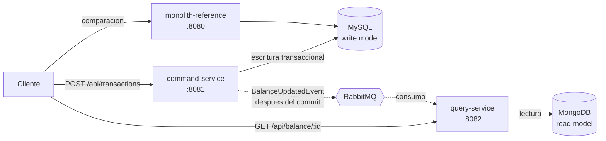

# CQRS Wallet

Un servicio de billetera que separa las escrituras de las lecturas (CQRS) para
medir, contra un monolito equivalente, cuanto aporta realmente esa separacion.

El repositorio no es solo una implementacion de CQRS: incluye un **monolito de
referencia** que resuelve el mismo problema con la misma base de datos, y un
banco de pruebas de carga que compara ambas arquitecturas bajo la misma carga.
La conclusion no es que CQRS sea mejor, sino **en que dimension gana y cual es su
costo**.

---

## Que hace

- Registra movimientos de credito y debito sobre cuentas, con validacion de saldo.
- Mantiene un modelo de lectura desnormalizado para consultar saldos.
- Propaga los cambios del lado de escritura al de lectura mediante eventos.
- Expone la misma funcionalidad en un monolito, para comparar.

---

## Arquitectura



El lado de escritura es la unica fuente de verdad. El lado de lectura es una
proyeccion que puede ir por detras: el sistema es **consistente en ultima
instancia**, no inmediatamente.

---

## Resultados medidos

Comparacion directa monolito vs CQRS con JMeter 5.6.3. Cada nivel de carga corre
180 s con rampa de 30 s, y el stack se reinicia entre corridas para que ninguna
arrastre estado de la anterior. Entre 230.000 y 266.000 muestras por corrida en
local. **Tasa de error 0,00 % en todas las corridas.**

### Lecturas: la separacion se nota y escala plano

Latencia p50 de `GET /balance` en local (ms):

| Hilos | Monolito | CQRS |
|---:|---:|---:|
| 50 | 16 | **1** |
| 100 | 53 | **1** |
| 200 | 112 | **1** |
| 350 | 216 | **1** |
| 500 | 315 | **1** |

El monolito se degrada casi 20x entre 50 y 500 usuarios concurrentes. El lado de
lectura de CQRS **no se mueve**: p50 de 1 ms y p95 de 4 ms en los cinco niveles.
Las lecturas no compiten con las escrituras porque no tocan la misma base de datos.

### Escrituras: ese beneficio se paga

Latencia p50 de `POST /transactions` en local (ms):

| Hilos | Monolito | CQRS | Sobrecosto |
|---:|---:|---:|---:|
| 50 | 56 | 98 | 1,8x |
| 100 | 91 | 202 | 2,2x |
| 200 | 156 | 462 | 3,0x |
| 350 | 270 | 726 | 2,7x |
| 500 | 365 | 1042 | 2,9x |

El camino de escritura hace lo mismo que el monolito **y ademas** publica un
evento. La brecha se ensancha con la carga. A 500 hilos, una escritura CQRS tarda
casi un segundo contra 365 ms del monolito.

### En AWS la ventaja aparece mas tarde

Latencia p50 de `GET /balance` sobre EC2 (ms):

| Hilos | Monolito | CQRS |
|---:|---:|---:|
| 50 | 90 | 88 |
| 100 | 90 | 88 |
| 200 | 99 | 89 |
| 350 | 151 | **89** |
| 500 | 189 | **89** |

Con poca carga las dos arquitecturas son indistinguibles: la latencia de red
(~90 ms) domina y esconde cualquier diferencia de diseno. La ventaja de CQRS solo
emerge a partir de 200 hilos, cuando el monolito empieza a degradarse y el lado
de lectura sigue plano.

**Lectura de todo esto:** CQRS aqui no es "mas rapido". Cambia latencia de
escritura y complejidad operativa por lecturas que no se degradan bajo carga. En
un sistema con pocas lecturas, o desplegado donde la red domina, esa permuta no
compensa.

Datos crudos: [`jmeter/sweep-20260510-214833.csv`](jmeter/sweep-20260510-214833.csv)
(local) y [`jmeter/sweep-aws-20260511-023510.csv`](jmeter/sweep-aws-20260511-023510.csv) (AWS).

Las cifras miden los caminos de peticion HTTP. La proyeccion asincrona cambio
despues de estas corridas al anadirse el descarte de eventos atrasados, lo que
agrega una lectura por evento en el consumidor sin afectar la latencia de las
peticiones medidas.

---

## Stack

| Componente | Tecnologia |
|---|---|
| Lenguaje | Java 17 |
| Framework | Spring Boot 3.2.5 |
| Write model | MySQL 8.0 + Spring Data JPA |
| Read model | MongoDB 7.0 |
| Mensajeria | RabbitMQ 3.13 |
| Empaquetado | Docker + Docker Compose |
| Pruebas de carga | JMeter 5.6.3 |
| Pruebas | JUnit 5 + Mockito + AssertJ |

---

## Decisiones tecnicas

**Por que dos bases de datos y no una.** El objetivo era aislar la contencion
entre lecturas y escrituras. Con una sola base, separar los modelos no habria
cambiado nada medible: seguirian compitiendo por las mismas paginas y bloqueos.
MongoDB guarda el saldo ya calculado, asi que una consulta es una busqueda por
clave.

**Por que el evento se publica despues del commit.** `AfterCommitEventForwarder`
escucha con `@TransactionalEventListener(AFTER_COMMIT)`. Si se publicara dentro de
la transaccion, un rollback posterior dejaria al read model con un saldo que nunca
existio. Publicar despues garantiza que solo se propagan hechos confirmados.

**Por que bloqueo pesimista en el saldo.** `AccountRepository.findByIdForUpdate`
usa `@Lock(PESSIMISTIC_WRITE)`. Sin el, dos debitos simultaneos sobre la misma
cuenta pueden leer el mismo saldo y validar ambos contra fondos ya comprometidos.
Con contencion alta sobre la misma fila, un bloqueo optimista con reintentos
generaria mas trabajo desperdiciado que espera.

**Por que el consumidor descarta eventos antiguos.** La cola reintenta con
backoff y termina en una DLQ, asi que un evento puede reentregarse tarde. Como el
evento lleva el saldo ya calculado y no un incremento, reaplicarlo es inocuo, pero
aplicar uno *anterior* al ya proyectado dejaria un saldo obsoleto de forma
permanente. `EventConsumer` compara la marca de tiempo y descarta lo que llega
atrasado.

**Por que se conserva el monolito.** Sin una linea base medida con la misma carga
y las mismas herramientas, cualquier afirmacion sobre CQRS seria una suposicion.
`monolith-reference` existe para que la comparacion sea reproducible.

---

## Ejecucion local

Requisitos: Docker y Docker Compose.

```bash
cp .env.example .env
docker compose up -d --build
```

El compose no trae credenciales por defecto: si falta `.env` la orden falla
indicando que variable hay que definir. Los seis contenedores declaran
`healthcheck` y las aplicaciones esperan a que la infraestructura este sana antes
de arrancar. MySQL se siembra desde `init.sql` con cuentas `ACC001` en adelante.

Variables disponibles en [`.env.example`](.env.example): credenciales de MySQL y
RabbitMQ y nombres de las bases de datos.

| Servicio | URL |
|---|---|
| command-service | http://localhost:8081 |
| query-service | http://localhost:8082 |
| monolith-reference | http://localhost:8080 |
| RabbitMQ (consola) | http://localhost:15672 |

Comprobar que todo respondio:

```bash
curl http://localhost:8081/actuator/health
```

Para detener y borrar los volumenes:

```bash
docker compose down -v
```

---

## API

### Registrar un movimiento

```bash
curl -X POST http://localhost:8081/api/transactions \
  -H "Content-Type: application/json" \
  -d '{"accountId":"ACC001","amount":250.00,"type":"DEBIT"}'
```

```json
{"transactionId":"a9e1ab3f-...","status":"SUCCESS","timestamp":"2026-08-16T20:19:05Z"}
```

### Consultar el saldo proyectado

```bash
curl http://localhost:8082/api/balance/ACC001
```

```json
{"accountId":"ACC001","balance":9750.00,"lastUpdated":"2026-08-16T20:19:05Z"}
```

### Respuestas de error

| Situacion | HTTP | Codigo |
|---|---:|---|
| Saldo insuficiente | 422 | `INSUFFICIENT_FUNDS` |
| Cuenta inexistente | 404 | `ACCOUNT_NOT_FOUND` |
| Monto invalido o campo faltante | 400 | `VALIDATION_ERROR` |
| Sin proyeccion para la cuenta | 404 | `BALANCE_NOT_FOUND` |

---

## Pruebas

```bash
mvn test
```

15 pruebas en total.

`command-service` (9) cubre las reglas del lado de escritura: credito, debito,
debito del saldo exacto, rechazo por fondos insuficientes y por cuenta inexistente,
persistencia del movimiento y uso del bloqueo pesimista. Tambien fija el
comportamiento del reenvio posterior al commit ante un fallo del broker.

`query-service` (6) cubre la proyeccion: creacion de la primera proyeccion,
aplicacion de un evento mas reciente, descarte de uno atrasado, reaplicacion del
mismo evento, y la consulta de un saldo inexistente.

Las pruebas de carga requieren JMeter instalado:

```bash
./jmeter/run-fair-benchmark.sh 180 30 "50,100,200,350,500"
```

---

## Limitaciones conocidas

- **No hay outbox transaccional.** El lado de consumo si reintenta y descarta a
  una DLQ, pero el de publicacion no: si RabbitMQ esta caido justo despues del
  commit, `AfterCommitEventForwarder` registra el error y el evento se pierde, y
  el saldo proyectado queda desactualizado de forma permanente. Es el hueco mas
  serio del diseno y cerrarlo exige persistir el evento en la misma transaccion
  que la escritura.
- **El read model puede ir por detras.** Una lectura inmediatamente despues de una
  escritura puede devolver el saldo anterior. Es inherente a CQRS, no un defecto,
  pero la API no ofrece forma de pedir una lectura consistente.
- **La guarda de eventos atrasados asume un unico consumidor.** Lee la proyeccion
  y despues escribe, asi que con varios consumidores en paralelo dos eventos
  podrian intercalarse. Escalar el consumo exigiria una escritura condicional en
  la propia base de datos.
- **`monolith-reference` no tiene pruebas automatizadas.** Existe como linea base
  de comparacion, no como codigo a evolucionar.
- **Las credenciales de `.env` van en claro al contenedor.** Es aceptable en local;
  un despliegue real deberia tomarlas de un gestor de secretos.
- **Los numeros en AWS provienen de un entorno academico** con instancias
  limitadas; sirven para comparar las dos arquitecturas entre si, no como
  referencia absoluta de capacidad.
